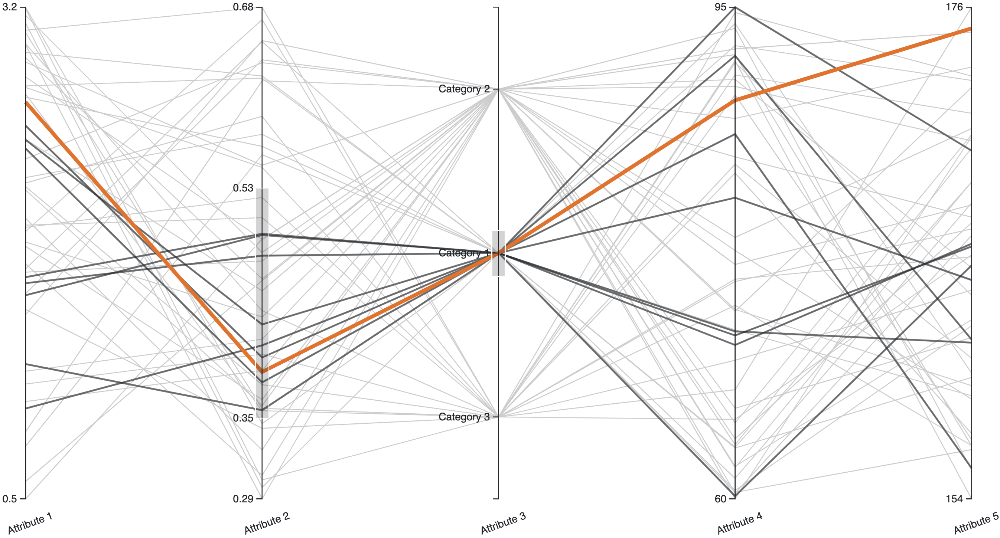
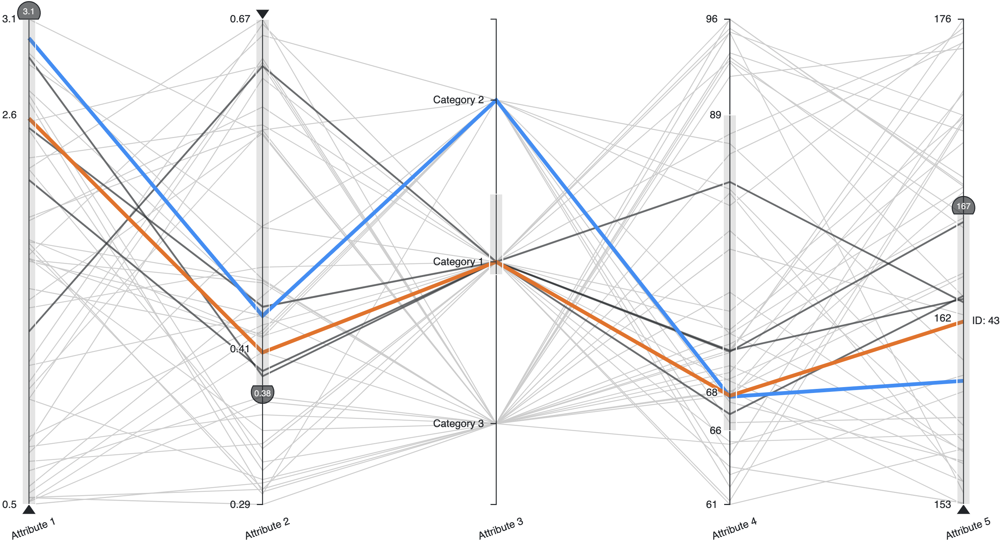
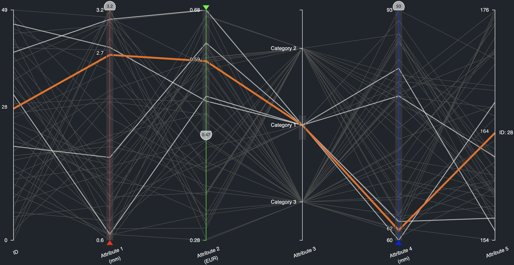
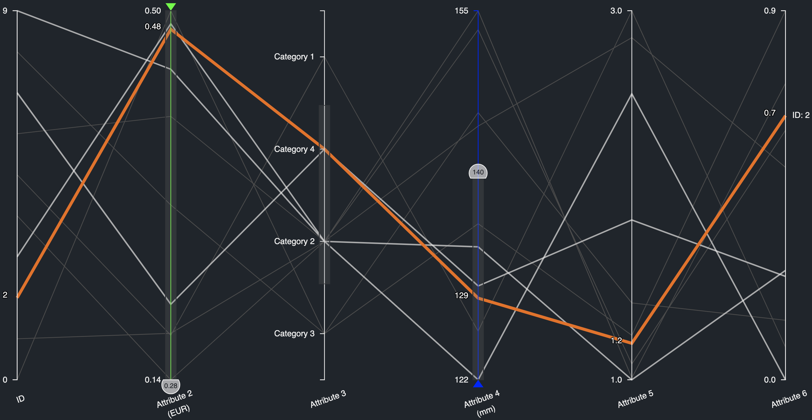
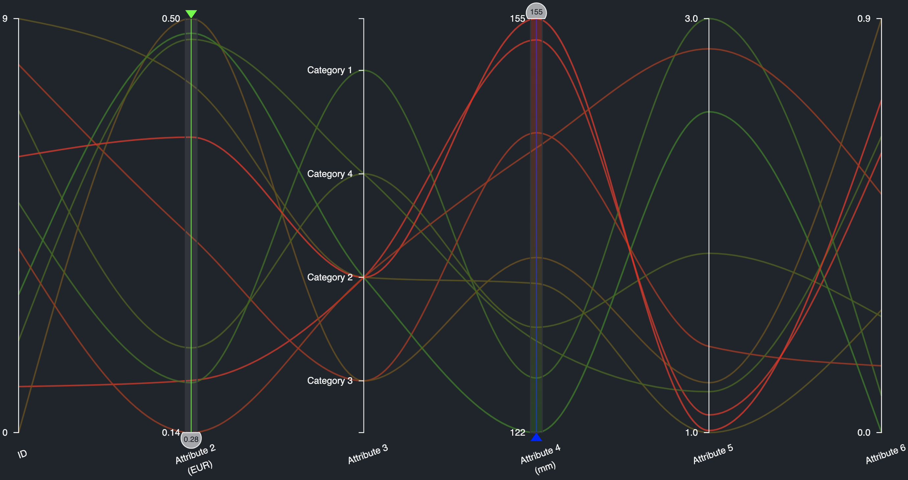

# PAVED.js: Pareto Front Visualization

PAVED is an interactive visualization built to ease cost-benefit trade-offs when deciding among a set of multi-attribute items.

**About PAVED**
PAVED uses parallel coordinates as a visualization technique to provide a compact yet lossless overview of all items and their properties.
It facilitates multi-attribute decisions by offering simple interactions for filtering out undesired items, exploring attribute conflicts, and bookmarking favorite items.
It can be used for decisions in professional contexts like product development or engineering design but also helps with personal decisions like apartment rental or car purchase.

## Features

-   Responsive design
-   Heterogeneous attribute types (numerical, categorical, boolean)
-   Axis re-ordering via drag and drop
-   Various filtering capabilities: standard selection rectangle, preference brush, gradient brush, line brush
-   Bookmarking of polylines
-   Curve smoothing
-   [React wrapper]() (coming soon)
-   [Demo application](https://paved.iva.igd.fraunhofer.de) with test dataset
-   [API documentation]() (coming soon)

## Usage

### Installation

The setup requires [Node.js v16 or higher](https://nodejs.org/en/download/).

```bash
git clone https://github.com/fraunhofer-igd-iva/pavedjs.git
cd pavedjs
npm install
npm run build
```

This generates the production build in `./lib/`.
From there, the library can be embedded in an HTML document by adding it as an external script file using a relative path: `<script src="../pavedjs/lib/index.js"></script>`.
It can also be added as a local dependency to your `package.json`:

```javascript
"dependencies": {
	"pavedjs": "file:../pavedjs/lib"
}
```

### Minimal Usage Example Parallel Coordinates

To try out this example, open the file `./src/Examples/MinimalUsageExamplePC.html` in a browser of your choice.

```javascript
// Generate some demo data
const rows = [];
const categories = ["Category 1", "Category 2", "Category 3"];
for (let i = 0; i < 50; ++i) {
	rows.push({
		"Attribute 1": Math.random() * (3.2 - 0.5) + 0.5,
		"Attribute 2": Math.random() * (0.68 - 0.28) + 0.28,
		"Attribute 3": categories[Math.floor(Math.random() * 3)],
		"Attribute 4": Math.random() * (96 - 60) + 60,
		"Attribute 5": Math.random() * (153 - 130) + 153,
	});
}
```

```javascript
// Render visualization
const chart = PAVEDJS.asParallelCoordinates(document.body, rows);
```



### Minimal Usage Example PAVED

To try out this example, open the file `./src/Examples/MinimalUsageExamplePAVED.html` in a browser of your choice.

```javascript
// Generate some demo data
const rows = [];
const categories = ["Category 1", "Category 2", "Category 3"];
for (let i = 0; i < 50; ++i) {
	rows.push({
		"Attribute 1": Math.random() * (3.2 - 0.5) + 0.5,
		"Attribute 2": Math.random() * (0.68 - 0.28) + 0.28,
		"Attribute 3": categories[Math.floor(Math.random() * 3)],
		"Attribute 4": Math.random() * (96 - 60) + 60,
		"Attribute 5": Math.random() * (153 - 130) + 153,
	});
}
```

```javascript
// Add optimization directions as meta data for attributes
const columns = [
	{
		name: "Attribute 1",
		obj: "MIN",
	},
	{
		name: "Attribute 2",
		obj: "MAX",
	},
	{
		name: "Attribute 5",
		obj: "MIN",
	},
];

const data = {
	columns: columns,
	rows: rows,
};
```

```javascript
// Render visualization
const chart = PAVEDJS.asPAVED(document.body, data);
```



### Advanced Usage Example PAVED

To try out this example, open the file `./src/Examples/AdvancedUsageExamplePAVED.html` in a browser of your choice.

```javascript
// Generate some demo data
const rows = [];
const categories = ["Category 1", "Category 2", "Category 3"];
for (let i = 0; i < 50; ++i) {
	rows.push({
		"Attribute 1": Math.random() * (3.2 - 0.5) + 0.5,
		"Attribute 2": Math.random() * (0.68 - 0.28) + 0.28,
		"Attribute 3": categories[Math.floor(Math.random() * 3)],
		"Attribute 4": Math.random() * (96 - 60) + 60,
		"Attribute 5": Math.random() * (153 - 130) + 153,
	});
}
```

```javascript
// Configure visualization
const options = {
	padding: {
		top: 50,
		right: 40,
		bottom: 60,
		left: 40,
	},
};
const builder = PAVEDJS.builder(rows, options);
builder
	.registerOptimizationDirections({
		"Attribute 1": PAVEDJS.OPTIMIZATION_TYPE.MIN,
		"Attribute 2": PAVEDJS.OPTIMIZATION_TYPE.MAX,
		"Attribute 4": PAVEDJS.OPTIMIZATION_TYPE.MIN,
	})
	.registerHEXColors({
		"Attribute 1": "#FF0000",
		"Attribute 2": "#00FF00",
		"Attribute 4": "#0000FF",
	})
	.registerUnits({
		"Attribute 1": "mm",
		"Attribute 2": "EUR",
		"Attribute 4": "mm",
	});
```

```javascript
// Render visualization
const chart = builder.buildPAVED(document.body);
```

```javascript
// Subsequent modifications. Do not forget to update the chart.
chart
	.setTheme(PAVEDJS.THEME.DARK)
	.setHoveredIDChangeHandler((id) => {
		console.log("Hovered ID", id);
	})
	.setFlaggedIDsChangeHandler((ids) => {
		console.log("Flagged IDs", ids);
	})
	.update();
```



The following changes are typically triggered by user interaction, e.g., by button clicks when using the example file.
Data updates must not change the type of an attribute, i.e., from nominal to numerical or vice versa.

```javascript
// Load new data
const alternativeRows = [];
const categories = ["Category 1", "Category 2", "Category 3", "Category 4"];
for (let i = 0; i < 10; ++i) {
	alternativeRows.push({
		"Attribute 2": Math.random() * (0.55 - 0.13) + 0.13,
		"Attribute 3": categories[Math.floor(Math.random() * 4)],
		"Attribute 4": Math.random() * (162 - 121) + 121,
		"Attribute 5": Math.random() * (3.2 - 0.8) + 0.8,
		"Attribute 6": Math.random(),
	});
}
chart
	.setRows(alternativeRows)
	//.setDimensionSubset(["Attribute 3", "Attribute 4"])
	.update();
```



```javascript
// Activate gradient brush on a particular attribute
chart
	.enableColorCoding({
		type: PAVEDJS.COLOR_CODING.GRADIENT_BRUSH,
		attribute: "Attribute 4",
	})
	.update();
```

```javascript
// Activate curve smoothing
chart
	.setCurveSmoothing(true)
	.update();
```



### Detailed Comparison of Features

| Feature                         | Parallel Coordinates | PAVED |
| ------------------------------- | -------------------- | ----- |
| Heterogeneous attributes        | ✅                   | ✅    |
| Unit metadata                   | ✅                   | ✅    |
| Axis re-ordering                | ✅                   | ✅    |
| Light and dark mode             | ✅                   | ✅    |
| Polyline highlighting on hover  | ✅                   | ✅    |
| Standard selection rectangle    | ✅                   | ✅    |
| Optimization direction metadata | ❌                   | ✅    |
| Objective color metadata        | ❌                   | ✅    |
| Axis tooltips on hover          | ❌                   | ✅    |
| Preference brush                | ❌                   | ✅    |
| Gradient brush                  | ❌                   | ✅    |
| Line brush                      | ❌                   | ✅    |
| Polyline bookmarks              | ❌                   | ✅    |
| Curve smoothing                 | ❌                   | ✅    |

## Demo Application

A demo application of PAVED is deployed at https://paved.iva.igd.fraunhofer.de/.
It showcases a dataset containing 168 electric motors. Which of the motor designs offers the best compromise? Compare five quality criteria and nine geometry parameters to decide. The data is provided by [LCM](https://www.lcm.at/en/electrical-drives/).

## API Documentation

Coming soon.

## React Support (PAVED.jsx)

Coming soon.

## Related Publication

Lena Cibulski, Hubert Mitterhofer, Thorsten May, Jörn Kohlhammer. **PAVED: Pareto Front Visualization for Engineering Design**. In _Computer Graphics Forum_, 39(3), pp. 405-416, [doi:10.1111/cgf.13990](https://doi.org/10.1111/cgf.13990), 2020. [📄Paper](https://onlinelibrary.wiley.com/doi/pdf/10.1111/cgf.13990) [🎬Talk](https://www.youtube.com/watch?v=QYHaFxfIm0M) (12 Min.)

## Dependencies

PAVED.js depends on

-   [D3](https://d3js.org/) utilities: array, axis, brush, color, drag, scale, selection, shape, transition
-   [Raphaël](https://dmitrybaranovskiy.github.io/raphael/)

**Development Dependencies**
[Webpack](https://webpack.js.org/) is used as build tool. PAVED.js itself is written in [TypeScript](https://www.typescriptlang.org/).

## License

PAVED.js is released under the MIT license. See the [LICENSE](LICENSE) file for detailed information.

## Contributions

We welcome and appreciate all contributions to this project.
Before getting started, try searching the issue tracker for known issues or fixes. For significant changes, in particular those that are based on your personal opinion, please open an issue first describing the changes you would like to make.

## Authors

[Lena Cibulski](https://www.igd.fraunhofer.de/en/institute/employees/lena-cibulski.html), Fraunhofer IGD

## Acknowledgments 

This work was funded by the EC Horizon 2020 programme under grant agreement n°768892. 

This work has been supported by the Linz Center of Mechatronics within the framework of the Austrian COMET-K2 program.
